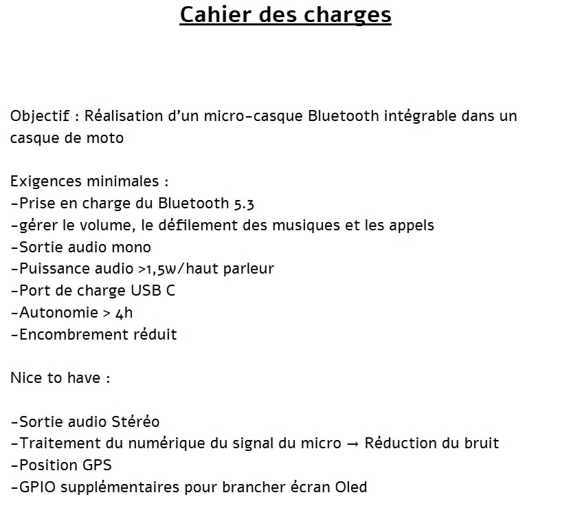
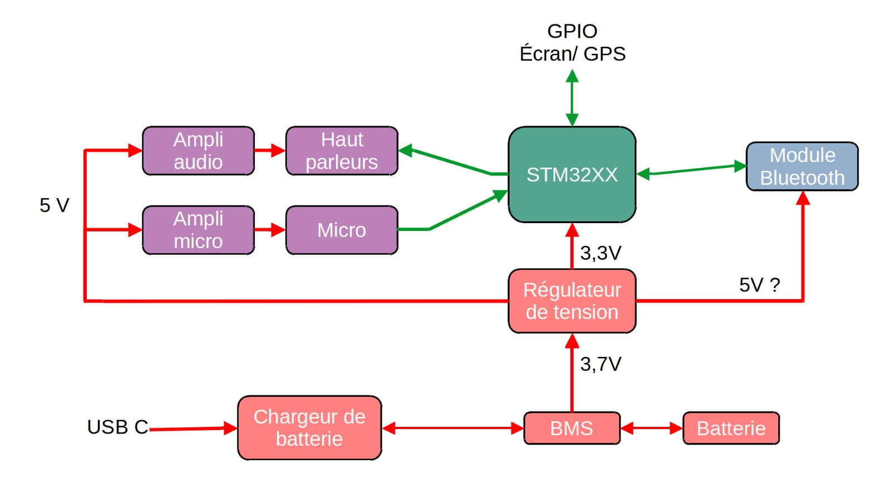

# RECAP PROJET - (séance 1)

# MODULE BLUETTOTH UTILISE
[Voir le PDF complet](https://www.micros.com.pl/mediaserver/RF_2611011024000_0002.pdf)

 Datasheet ESP32-Wroom-32D
 [Voir le PDF complet](https://www.espressif.com/sites/default/files/documentation/esp32-wroom-32d_esp32-wroom-32u_datasheet_en.pdf)
 

 

# (séance 2)

Nous avons décidé de remplacer le module ESP32 WROOM 32D par un module bluetooth BM83.

# Présentation du BM83

Le **BM83** est un module Bluetooth développé par **Brookstone**. Il permet une connexion sans fil pour de nombreux appareils, facilitant l'intégration de technologies modernes dans des dispositifs audio et autres équipements électroniques.

## Caractéristiques principales :
- **Bluetooth 5.0** : Assure une connexion stable et rapide.
- **Compatibilité étendue** : Fonctionne avec une large gamme d'appareils.
- **Transmission de haute qualité** : Son clair et stable.
- **Faible consommation d'énergie** : Prolonge la durée de vie des batteries.

Le BM83 est idéal pour ceux qui recherchent une solution pratique et efficace pour ajouter la connectivité Bluetooth à leurs appareils.

